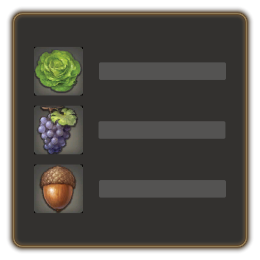

**Shop Item Icons** is a small plugin to display item icons instead of item category icons in shops. 
 

Supported windows:

- **Shops:** Simple merchants that sell items for Gil.
- **Item Exchange:** Vendors that trade items for items, such as the Wolf Collar Exchange or Itinerant Moogles that exchange items for Irregular Tomestones during the Moogle Treasure Trove event.
- **Item Exchange (categorized):** Splendors Vendors, the Scrip Exchange or the Wolf Mark Exchange.
- **Currency Exchange:** Vendors that sell items for currency, such as all the societies vendors, or the Trophy Crystal Exchange.
- **Grand Company Seal Exchange:** Quartermasters of Grand Companies.
- **Rewards:** Vendors that provide job gear free of charge.
- **Exchange:** Calamity Salvager when exchanging old pigments for all-purpose pigments.

The plugin has no configuration. It just works. Hopefully.

Preview:

